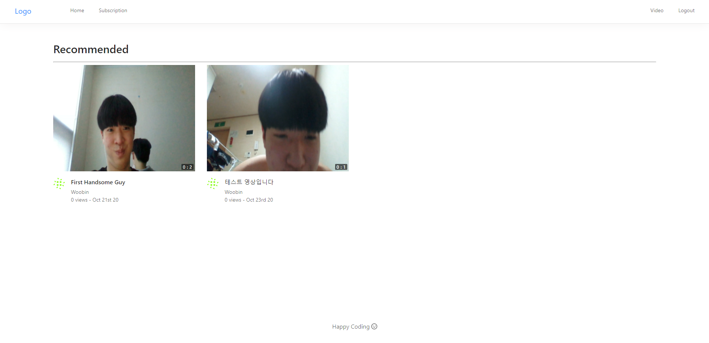

# ChoTube

## React 와 MongoDB , FireBase 를 이용하여 유튜브 클론코딩하기!

#### concurrently 를 이용하면 동시에 서버와 클라이언트 실행이 가능하다

#### 해당 방법으로 파일을 서버측으로 보낼 수 있다.


# ffmpeg

#### ffmpeg 란 모듈을 사용하면 비디오의 썸네일 , 영상의 길이 정보를 가져올 수 있다

<a href="https://ffmpeg.org/about.html">ffmpeg.com</a>


# 메인화면



# 업로딩 화면


# 비디오 자세히보기


# 댓글 창


```javascript
export default function Test(props) {
    props.history.push('/')
}

```

#### 리액트는 props.history.push('/') 를 하는것으로 초기화면으로 갈 수 있다.

# 데이터 주고받기

#### 서버가 해당 이미지처럼 res.json({전달내용}) 을 보낸다면


#### 클라이언트는 .then(res => res.data.(전달내용)) 으로 접근이 가능하다.


# AntDesign

#### <a href="https://ant.design">Ant Design</a> 를 사용하면 css를 사용하지 않아도 충분히 구조화된 Template 을 만들 수 있다


# TypeError


#### 해당 오류는 개발하다 보면 어렵지 않게 접할 수 있는데 이는 VSCode 자동완성 기능 때문이다

```javascript
import { response } from 'express'
```

#### response 를 입력하다보면 express 에서 가져오기  가 자동완성 되는데 이처럼 실행되는 경우 해당 타입에러가 뜨게된다.

# 상향식 상태관리

```javascript
    const refreshFunction = (newContent) => {
        setValue(value.concat(newContent))
    }
    // ...
    <Children refresh={refreshFunction} />
```

#### 상단의 코드와 같이 자신의 State를 수정하는 Function 을 만들어 자식 컴포넌트 에게 전달 한 후 기존 상태와 concat() 등을 활용해 합춰주면 된다.