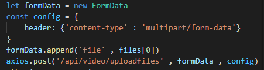
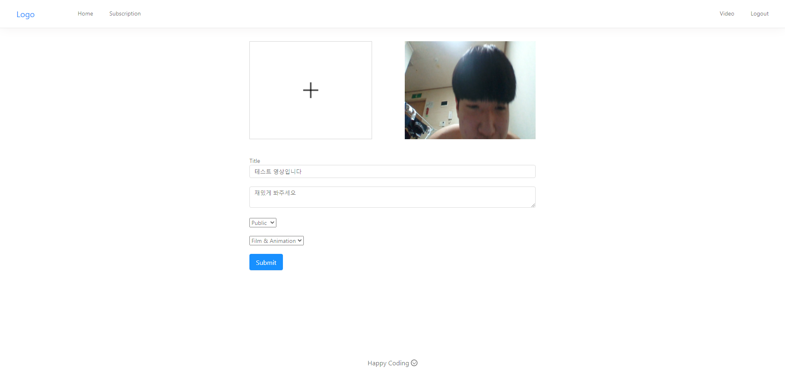

# ChoTube

## React 와 MongoDB , FireBase 를 이용하여 유튜브 클론코딩하기!

#### concurrently 를 이용하면 동시에 서버와 클라이언트 실행이 가능하다

#### 해당 방법으로 파일을 서버측으로 보낼 수 있다.


# ffmpeg

#### ffmpeg 란 모듈을 사용하면 비디오의 썸네일 , 영상의 길이 정보를 가져올 수 있다

<a href="https://ffmpeg.org/about.html">ffmpeg.com</a>


# 업로딩 화면



```javascript
export default function Test(props) {
    props.history.push('/')
}

```

#### 리액트는 props.history.push('/') 를 하는것으로 초기화면으로 갈 수 있다.

# 데이터 주고받기

#### 서버가 해당 이미지처럼 res.json({전달내용}) 을 보낸다면


#### 클라이언트는 .then(res => res.data.(전달내용)) 으로 접근이 가능하다.


# AntDesign

#### <a href="ant.design">Ant Design</a> 를 사용하면 css를 사용하지 않아도 충분히 구조화된 Template 을 만들 수 있다

